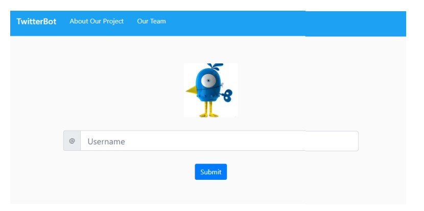
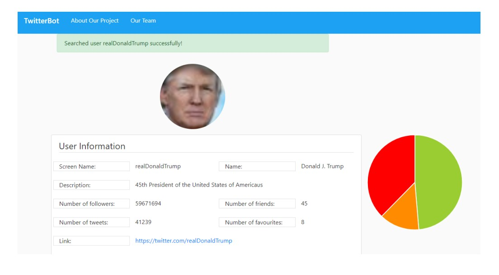
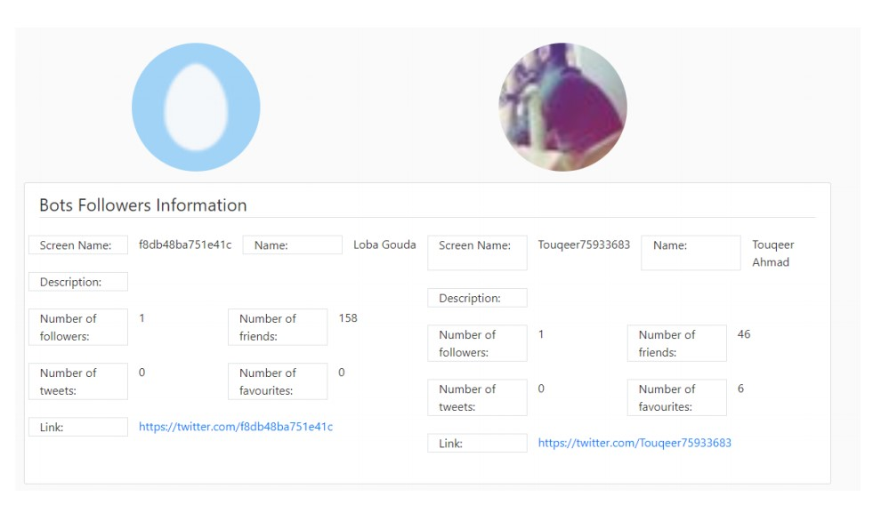

# Twitter Bots Detector

This app was developed with some classmates during my class **CSCI 6221 - Advanced Software Paradigms** at GWU. The app provides a way to classify the followers of a user in three categories: real, bots and doubtful. This information can show the percentage of real followers that a user has, giving a better idea of how many people these users are reaching not corrupted by the huge number of bots in the social network.

My job was to come up with a way to determine if a user is likely to be a bot or not with information available from the twitter API. We use different rules such as the number of people followed, the ratio between followers and people follow, the username format, number of RTs and FAVs, and many others. You can read the [report](./FinalReport.pdf) to get a better idea of the methodology and also take a look at our [presentation](./FinalPresentation.pdf).

I also did most of the website coding too, you can take a look at the different files and see the images in the [screenshots folder](./Screenshots) to have an idea on how the app looks like. The application was developed with the following technologes:
* Python Flask
* MySQL DB
* [tweepy](https://www.tweepy.org/)

Our web application fetches data from the twitter API based on the user we want to analyze. It downloads 400 of its followers with all their data. This data is stored in the database. A STP performs an analysis on the data and decides if each follower is a real user, a bot, or it is unsure. The web application than pulls the analysis from the database and gives an overview of the user profile, the analysis of the followers, and some examples of each category.

If you want to install this app locally and make it work, you will also need to get twitter API credentials. If you are interested in this you can contact me and I can give more details.

I hope you like it!
